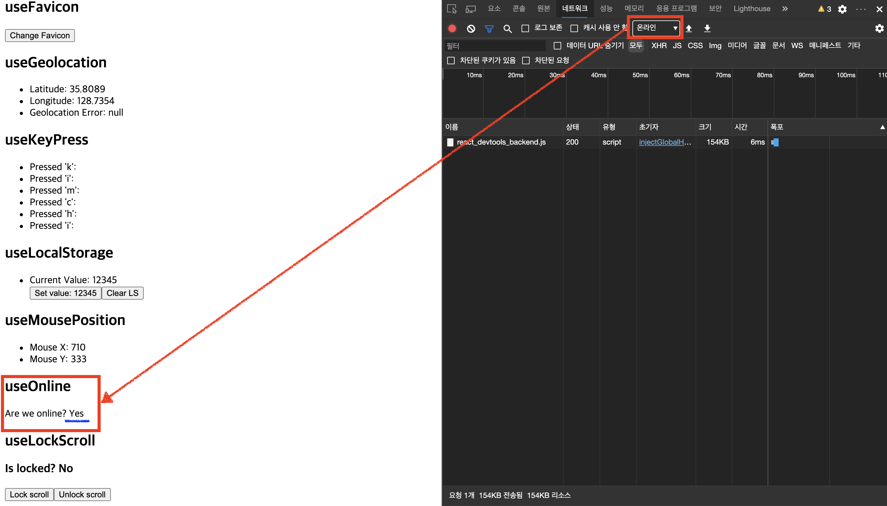
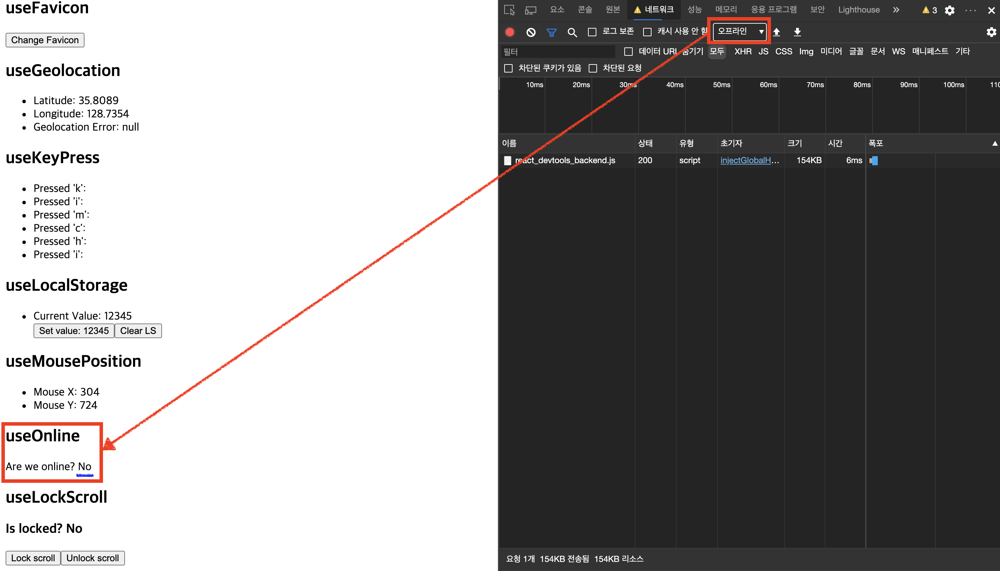

# React Hooks Library Site

[완성된 페이지](http://BlackMonkey56.github.io/React-Hooks)
- React Hooks의 useState와 useEffect를 사용하여 개발.

## 📝목차
1. [useDeviceOrientation](#1.-useDeviceOrientation): 기기의 기울기 값 출력
2. [useFavicon](#2.-useFavicon): 사이트의 favicon변경
3. [useGeolocation](##3.-useGeolocation): 현재 기기의 위치 출력
4. [useKeyPress](#4.-useKeyPress): 키보드 입력에 따른 출력
5. [useLocalStorage](#5.-useLocalStorage): 브라우저 Local Storage 컨트롤
6. [useMousePosition](#6.-useMousePosition): 사이트 화면 상의 마우스 위치 출력
7. [useOnline](#7.-useOnline): 브라우저의 네트워크 연결 유무 출력
8. [useLockScroll](#8.-useLockScroll): 스크롤 컨트롤

## 1. useDeviceOrientation
- 모바일을 통해 접속할 경우 모바일 기기의 기울기 데이터를 보여줌.
- <b>[Components/UseDeviceOrientation.js</b>
  ```javascript
  import React from "react";
  import useDeviceOrientation from "../Hooks/useDeviceOrientation";

  const UseDviceOrientation = () => {
    const { alpha, beta, gamma } = useDeviceOrientation();
    return (
      <>
        <h2>useDeviceOrientation</h2>
        <ul>
          <li>Alpha: {alpha}</li>
          <li>Beta: {beta}</li>
          <li>Gamma: {gamma}</li>
        </ul>
      </>
    );
  };

  export default UseDviceOrientation;

  ```
- <b>[Hooks/useDeviceOrientation/index.js]</b>
  ```javascript
  import { useState, useEffect } from "react";

  const useDeviceOrientation = () => {
    const [state, setState] = useState({
      alpha: 0,
      beta: 0,
      gamma: 0
    });

    const handleOrientation = event => {
      setState({
        ...state,
        alpha: event.alpha ? event.alpha : 0,
        beta: event.beta ? event.beta : 0,
        gamma: event.gamma ? event.gamma : 0
      });
    };

    useEffect(() => {
      if (window.DeviceOrientationEvent) {
        window.addEventListener("deviceorientation", handleOrientation, true);
      }

      return () => {
        if (window.DeviceOrientationEvent) {
          window.removeEventListener("deviceorientation", handleOrientation);
        }
      };
    }, []);

    return state;
  };

  export default useDeviceOrientation;

  ```

## 2. useFavicon
- 버튼 클릭 시 favicon 이미지의 경로를 바꿔서 변경하도록 함.
- <b>[Components/UseFavicon.js]</b>
  ```javascript
  import React from "react";
  import useFavicon from "../Hooks/useFavicon";

  const UseFavicon = () => {
    const setFavicon = useFavicon(
      "https://www.webopixel.net/blog/wp-content/uploads/2018/08/react-icon.png"
    );
    const newFaviconUrl =
      "https://avatars0.githubusercontent.com/u/29245056?s=200&v=4";
    return (
      <>
        <h2>useFavicon</h2>
        <button onClick={() => setFavicon(newFaviconUrl)}>Change Favicon</button>
      </>
    );
  };

  export default UseFavicon;

  ```
- <b>[Hooks/useFavicon/index.js]</b>
  ```javascript
  import { useEffect } from "react";

  const useFavicon = initialFaviconUrl => {
    useEffect(() => {
      const favicon = document.querySelector("link[rel='icon']");
      favicon.href = initialFaviconUrl;
    }, [initialFaviconUrl]);

    const setFavicon = newFaviconUrl => {
      const favicon = document.querySelector("link[rel='icon']");
      favicon.href = newFaviconUrl;
    };

    return setFavicon;
  };

  export default useFavicon;

  ```

## 3. useGeolocation
- navigator객체의 geolocation의 데이터를 이용하여 현재 위치의 위도, 경도 정보를 보여줌.
- <b>[Components/UseGeolocation.js]</b>
  ```javascript
  import React from "react";
  import useGeolocation from "../Hooks/useGeolocation";

  const UseGeolocation = () => {
    const {
      coords: { lat, long },
      error
    } = useGeolocation();

    return (
      <>
        <h2>useGeolocation</h2>
        <ul>
          <li>Latitude: {lat}</li>
          <li>Longitude: {long}</li>
          <li>Geolocation Error: {error ? error : "null"}</li>
        </ul>
      </>
    );
  };

  export default UseGeolocation;

  ```
- <b>[Hooks/useGeolocation/index.js]</b>
  ```javascript
  import { useState, useEffect } from "react";

  const useGeolocation = () => {
    const [coords, setCoords] = useState({
      lat: 0,
      long: 0
    });
    const [error, setError] = useState(null);

    const successHandle = position => {
      setCoords({
        lat: position.coords.latitude,
        long: position.coords.longitude
      });
    };

    const errorHandle = () => {
      setError("Geolocation doesn't work...");
    };

    useEffect(() => {
      if (navigator.geolocation) {
        navigator.geolocation.getCurrentPosition(successHandle, errorHandle);
      } else {
        setError("Geolocation doesn't work...");
      }
    }, []);

    return { coords, error };
  };

  export default useGeolocation;

  ```

## 4. useKeyPress
- 키보드 특정 키를 입력하면 입력한 키를 브라우저 상에 출력함.
- <b>[Components/UseKeyPress.js]</b>
  ```javascript
  import React from "react";
  import useKeyPress from "../Hooks/useKeyPress";

  const UseKeyPress = () => {
    const kPressed = useKeyPress("k");
    const iPressed = useKeyPress("i");
    const mPressed = useKeyPress("m");
    const cPressed = useKeyPress("c");
    const hPressed = useKeyPress("h");

    return (
      <>
        <h2>useKeyPress</h2>
        <ul>
          <li>Pressed 'k': {kPressed && "K"}</li>
          <li>Pressed 'i': {iPressed && "I"}</li>
          <li>Pressed 'm': {mPressed && "M"}</li>
          <li>Pressed 'c': {cPressed && "C"}</li>
          <li>Pressed 'h': {hPressed && "H"}</li>
          <li>Pressed 'i': {iPressed && "I"}</li>
        </ul>
      </>
    );
  };

  export default UseKeyPress;

  ```
- <b>[Hooks/useKeyPress/index.js]</b>
  ```javascript
  import { useState, useEffect } from "react";

  const useKeyPress = key => {
    const [status, setStatus] = useState(false);

    const keyDownHandle = event => {
      if (event.key === key) {
        setStatus(true);
      }
    };

    const keyUpHandle = event => {
      if (event.key === key) {
        setStatus(false);
      }
    };

    useEffect(() => {
      window.addEventListener("keydown", keyDownHandle);
      window.addEventListener("keyup", keyUpHandle);

      return () => {
        window.removeEventListener("keydown", keyDownHandle);
        window.removeEventListener("keyup", keyUpHandle);
      };
    }, []);

    return status;
  };

  export default useKeyPress;

  ```

## 5. useLocalStorage
- 브라우저의 Local Storage에 접근하여 데이터 저장 및 삭제구현.
- <b>[Components/UseLocalStorage.js]</b>
  ```javascript
  import React from "react";
  import useLocalStorage from "../Hooks/useLocalStorage";

  const UseLocalStorage = () => {
    const [currentLS, setLS] = useLocalStorage("hook", "12345");

    return (
      <>
        <h2>useLocalStorage</h2>
        <ul>
          <li>Current Value: {currentLS}</li>
          <button onClick={() => setLS("12345")}>Set value: 12345</button>
          <button onClick={() => setLS(null)}>Clear LS</button>
        </ul>
      </>
    );
  };

  export default UseLocalStorage;

  ```
- <b>[Hooks/useLocalStorage/index.js]</b>
  ```javascript
  import { useState, useEffect } from "react";

  const useLocalStorage = (name, initialValue) => {
    const [currentLS, setCurrentLS] = useState(null);

    const setLS = value => {
      localStorage.setItem(name, value);
      setCurrentLS(
        localStorage.getItem(name) !== "null" ? localStorage.getItem(name) : null
      );
    };

    useEffect(() => {
      setLS(initialValue);
    }, []);

    return [currentLS, setLS];
  };

  export default useLocalStorage;

  ```

## 6. useMousePosition
- 브라우저 화면의 마우스 위치값을 보여줌.
- <b>[Components/UseMousePosition.js]</b>
  ```javascript
  import React from "react";
  import useMousePosition from "../Hooks/useMousePosition";

  const UseMousePosition = () => {
    const { x, y } = useMousePosition();

    return (
      <>
        <h2>useMousePosition</h2>
        <ul>
          <li>Mouse X: {x}</li>
          <li>Mouse Y: {y}</li>
        </ul>
      </>
    );
  };

  export default UseMousePosition;

  ```
- <b>[Hooks/useMousePosition/index.js]</b>
  ```javascript
  import { useState, useEffect } from "react";

  const useMousePosition = () => {
    const [x, setX] = useState(0);
    const [y, setY] = useState(0);

    const moveHandle = event => {
      setX(event.x);
      setY(event.y);
    };
    useEffect(() => {
      window.addEventListener("mousemove", moveHandle);

      return () => {
        window.removeEventListener("mousemove", moveHandle);
      };
    }, []);

    return { x, y };
  };

  export default useMousePosition;

  ```

## 7. useOnline
- 현재 기기의 브라우저 네트워크 연결 유무 상태를 보여줌.
<div style="display: flex; justify-contents: center; width: 100%;">
  <div style="display: flex; flex-direction: column; align-items: center; width: 50%; margin-right: 10px;">
    
    <span>[온라인 상태]</span>
  </div>
  <div style="display: flex; flex-direction: column; align-items: center; width: 50%; margin-right: 10px;">
    
    <span>[오프라인 상태]</span>
  </div>
</div>

- <b>[Components/UseOnline.js]</b>
  ```javascript
  import React from "react";
  import useOnline from "../Hooks/useOnline";

  const UseOnline = () => {
    const isOnLine = useOnline();

    return (
      <>
        <h2>useOnline</h2>
        <div>Are we online? {isOnLine ? "Yes" : "No"}</div>
      </>
    );
  };

  export default UseOnline;

  ```
- <b>[Hooks/useOnline/index.js]</b>
  ```javascript
  import { useState, useEffect } from "react";

  const useOnline = () => {
    const [state, setState] = useState(navigator.onLine);

    const handle = () => {
      if (navigator.onLine) {
        setState(true);
      } else {
        setState(false);
      }
    };

    useEffect(() => {
      window.addEventListener("online", handle);
      window.addEventListener("offline", handle);

      return () => {
        window.removeEventListener("online", handle);
        window.removeEventListener("offline", handle);
      };
    }, []);

    return state;
  };

  export default useOnline;

  ```

## 8. useLockScroll
- 버튼 클릭으로 브라우저의 스크롤 Lock/Unlock 설정.
- HTML의 body태그 스타일의 overflow속성을 변경해줌.
- <b>[Components/UseLockScroll.js]</b>
  ```javascript
  import React from "react";
  import useLockScroll from "../Hooks/useLockScroll";

  const UseLockScroll = () => {
    const [isLocked, { lockScroll, unlockScroll }] = useLockScroll();

    return (
      <>
        <h2>useLockScroll</h2>
        <h3>Is locked? {isLocked ? "Yes" : "No"}</h3>
        <button onClick={lockScroll}>Lock scroll</button>
        <button onClick={unlockScroll}>Unlock scroll</button>
      </>
    );
  };

  export default UseLockScroll;

  ```
- <b>[Hooks/useLockScroll/index.js]</b>
  ```javascript
  import { useState } from "react";

  const useLockScroll = () => {
    const [isLocked, setLock] = useState(false);

    const lockScroll = () => {
      setLock(true);
      const body = document.querySelector("body");
      body.style.overflow = "hidden";
    };

    const unlockScroll = () => {
      setLock(false);
      const body = document.querySelector("body");
      body.style.overflow = "";
    };

    return [isLocked, { lockScroll, unlockScroll }];
  };

  export default useLockScroll;

  ```
